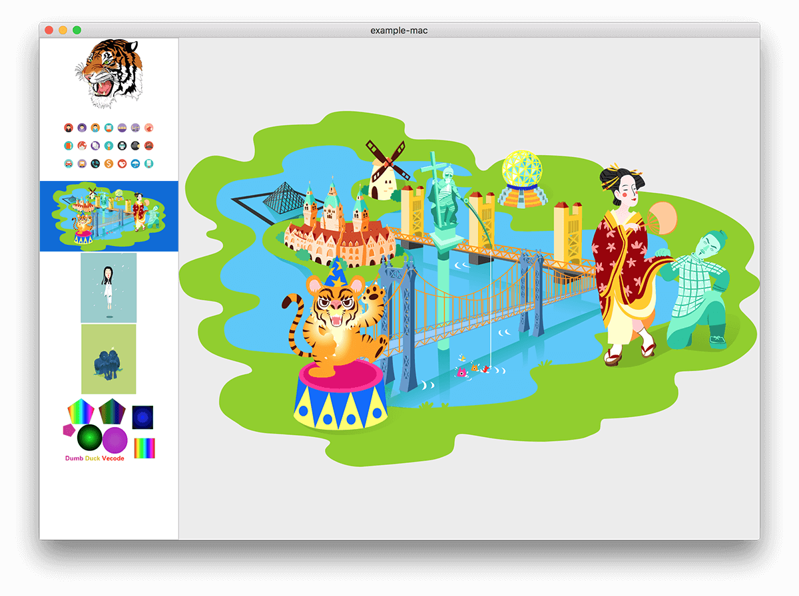
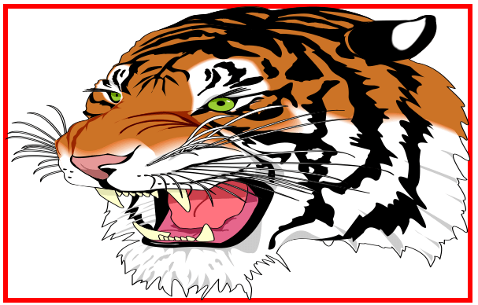
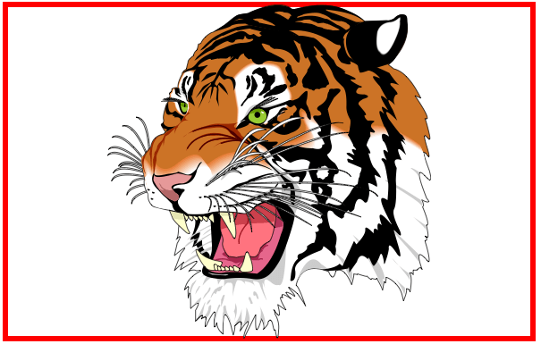
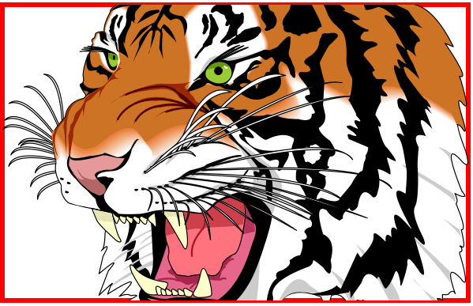
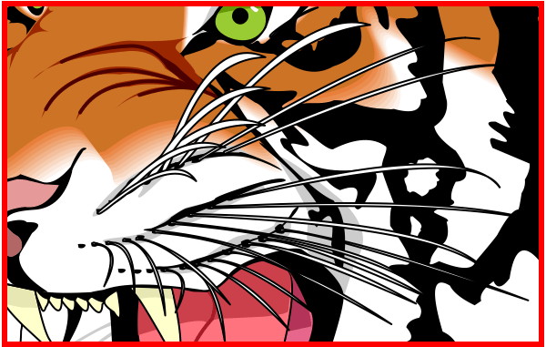

## Introduction

<image src="./images/vecode_icon.png" width="200" height="200"/>

Vecode is a blending word which combines <b>Vector</b> and <b>Code</b>. It helps developers and designers turn vector images to drawing codes or svg images.

For now, Vecode is able to import:

* swf vector format

Able to export:

* Quartz code (Objective-C)
* Quartz code (Swift)
* svg image
* png image

FYI Quartz code is a drawing code for iOS and OS X.

After turning vector image to drawing code, then add the drawing code into the project and compile. During runtime, the image will be redrawn and rescale size without distortion.

## VecodeKit
We've coded this project example VecodeKit, showing how to use the exported Quartz code.

VecodeKit includes an iOS and a Mac example, showing you how to use Quartz Code under Swift and Object-C accordingly.

</td>

## How to Use QuartzPicture

Add all codes in the folder QuartzPicture into your project, as well as the exported Quartz code.

For example, if we exported <b>tiger.swift</b> and created Object `g_picture_tiger`, after adding it into the project, we can call the function:

```Swift
VKQuartzPictureDrawInRect(g_picture_tiger, self.bounds, context, .ScaleAspectFit)
```
	
and draw the picture into the context.

## QuartzPicture API

### VKQuartzPicture

Including bounds, through

```Swift
picture.bounds.size
```
	
we can obtain the raw size of the picture. e.g, if you want an 2x image, you can use a section of codes as following:

```Swift
var rect = CGRectZero
rect.size = picture.bounds.size
rect.size.width *= 2
rect.size.height *= 2
VKQuartzPictureDrawInRect(picture, rect, context, .ScaleAspectFit)
```

### VKQuartzPictureDrawInRect
This is the core function, which draws the picture into the context.

```Swift
func VKQuartzPictureDrawInRect(picture   : VKQuartzPicture,
                               _ rect    : CGRect,
                               _ context : CGContextRef,
                               _ mode    : VKPictureContentMode)
```

The parameter <b>picture</b> signifies the to-be-drawn image, which is exported from Vecode; the parameter <b>rect</b> signifies the area of the picture; and the parameter <b>context</b> the drawing enviornment.


The meaning of the last parameter is similar with `UIViewContentMode`, which explains how to resize the image in the convenience of adapting the introduction of rect.


A tiger picture as bellow, is being drawn in the same rect (red frame), but with different modes, different results will be precented:

<image src="./images/tiger.png" width="250"/>

<table border="1px" style="table-layout:fixed;width:100%">
	<tr border="0" style="text-align:center">
		<td border="0" style="width:25%">ScaleToFill</th>
		<td border="0" style="width:25%">ScaleAspectFit</th>
		<td border="0" style="width:25%">ScaleAspectFill</th>
		<td border="0" style="width:25%">Center</th>
	</tr>
	<tr border="0">
		<td border="0" style="width:25%"></td>
		<td border="0" style="width:25%"></td>
				<td border="0" style="width:25%"></td>
						<td border="0" style="width:25%"></td>
	</tr>
</table>

